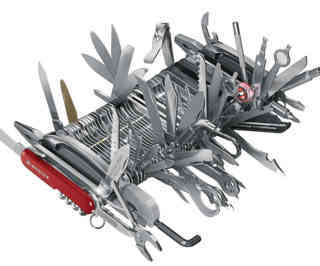

# michaels-helper-library (mhl.js)

Why?

-It's just a bunch of functions that I find useful.
-It's in a format that makes sense to me.
-It's fun to create.
-It saves me time rather than fully writing out vanilla javascript.
-It only includes the suff I know about.
-Anything missing can be added once I understand it and implement it.
